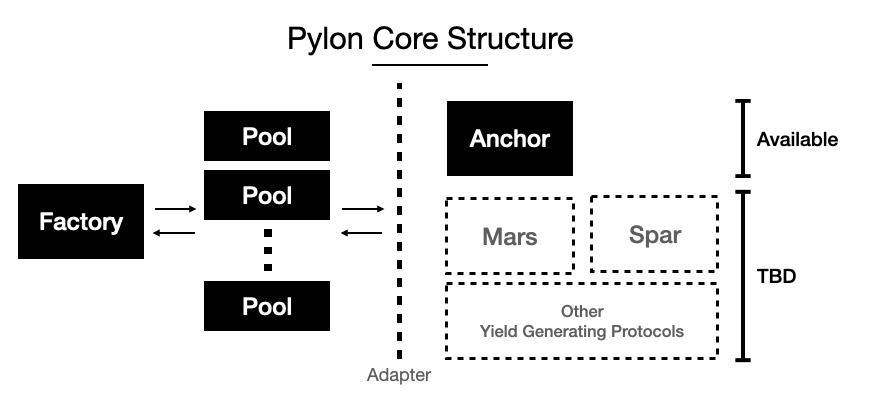

# Pylon Core

## Table of contents

* [Factory](#Factory) [(source)](./factory)
* [Pool](#Pool) [(source)](./pool)
* [Token](#Token) [(source)](./token)
* [Adapters](#Adapters) [(source)](./adapters)

### Factory

> TBD

### Pool

> TBD

### Token

> TBD

### Adapters

> TBD
